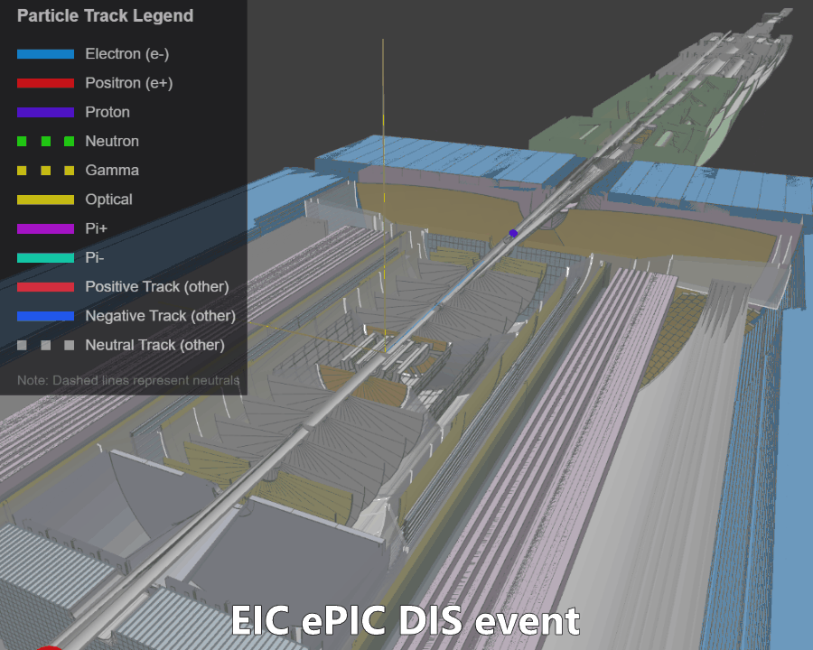

# Electron Ion Collider dynamic visualization
**(aka EIC Event Display)**

[](https://github.com/eic/firebird/actions/workflows/frontend.yaml)

- Event display: [seeeic.org](https://seeeic.org)
- Documentation and tutorials: [eic.github.io/firebird](https://eic.github.io/firebird/)

<a href="https://eic.github.io/firebird/">

</a>

## Project overview

**Firebird** is a web-based event display framework for particle physics
experiments, designed for the Electron-Ion Collider (EIC). It shows detector
geometries, detector responses (hits), particle trajectories and physics
processes as they develop in time, for research, debugging and quality
control, and education.

## Repository structure

This is a monorepo with npm workspaces (run `npm install` at the repository
root, never inside a member):

- **firebird-ng/** - the Firebird application (Angular, zoneless): its
  configuration, routes and developer pages, built from the library below
- **packages/firebird-ng/** - `@dexvis/firebird-ng`: the Angular library
  (`provideFirebird()` and its features, the display pages and
  `<firebird-display>`, the display services, the worker code)
- **packages/firebird-core/** - `@dexvis/firebird-core`: the worker-safe event
  model, DEX input and output, and painters
- **packages/epic/** - `@dexvis/firebird-epic`: the ePIC experiment pack,
  `withEpic()`, which the Firebird app installs
- **packages/root2dex/** - `@dexvis/root2dex`: EDM4eic/EDM4hep ROOT to DEX
  conversion in the browser, the TypeScript twin of `pyrobird convert`
- **packages/firebird-example-extension/** - a template for out-of-tree feature
  packs
- **dexvis/** - the generic [dexvis](https://github.com/dexvis) packages
  (geometry tree editors, the app shell, the navigation cube, the app feature
  machinery), mostly as git submodules
- **pyrobird/** - the Python Flask backend: local file server, ROOT
  conversion, batch screenshots
- **dd4hep-plugin/** - the C++ Geant4/DD4hep plugin that records trajectories
  during simulation
- **docs/** - the VitePress documentation site, deployed to
  [eic.github.io/firebird](https://eic.github.io/firebird/)
- **dex-schema/** - the JSON Schema of the Firebird data exchange format (DEX)

## Development

The supported Node.js major version is in `.nvmrc`.

```bash
npm install                                  # at the repository root
cd firebird-ng && npm run serve              # http://localhost:4200
npm run test:headless --workspace=firebird-ng
npm test -w @dexvis/firebird-ng              # the library's suite
python build.py full                         # build, all tests, pyrobird package
```

`CLAUDE.md` lists every test suite and the verification steps;
[pyrobird/README.md](pyrobird/README.md) covers the backend.

## License

The Firebird application (`firebird-ng/`), pyrobird and the DD4hep plugin are
licensed under GPL-3.0-or-later ([LICENSE](LICENSE)); the DD4hep-derived
sources of the plugin keep their CERN notices. The libraries in `packages/`
and the dexvis packages are MIT licensed, each with its own `LICENSE` file.
