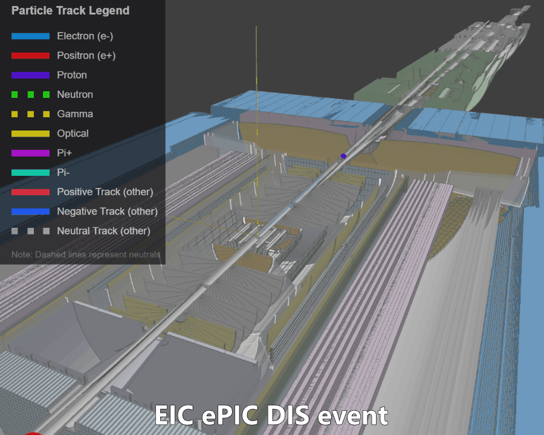

# DD4hep Plugin

Plugin for DD4hep that writes true particle trajectories (via Geant4 event/stepping actions)
to the Firebird data-exchange (DEX) format for visualization.

<a href="https://eic.github.io/firebird/">

</a>


## Usage

Here is the plan: 

1. Build C++ plugin with cmake
2. Add resulting files to `LD_LBRARY_PATH` so dd4hep could find the plugin
3. Run npsim/dd4hep with python steering file, that sets up the plugin
4. \[optional\] Configure plugin parameters (cuts and what to write)

### 1. Build and install the plugin

```bash
git clone https://github.com/eic/firebird.git
cd firebird/dd4hep-plugin

cmake -B build -S .
cmake --build build
cmake --install build          # installs into prefix/lib by default

ls prefix/lib                  # verify libfirebird-dd4hep.so is present

# Make the library and .components file discoverable:
export LD_LIBRARY_PATH="$(pwd)/prefix/lib${LD_LIBRARY_PATH:+:$LD_LIBRARY_PATH}"
```

### 2. Run ddsim with a steering file

The plugin ships with several pre-made steering files (see below). Pass one
via the `--steeringFile` flag:

```bash
ddsim \
  --steeringFile=my_steering.py \
  --compactFile=geometry \
  -N=5 \
  --outputFile=sim_output.edm4hep.root \
  --inputFiles sim_input.hepmc
```

> (!) Look for EIC specific example below!

This produces `sim_output.firebird.json` — a Firebird-format JSON file
containing the trajectory data.

> **Note:** For large events, or when optical photons are saved, the output
> file can easily reach gigabytes in size.


## How it works

The plugin provides several Geant4 "actions" that can be injected into DD4hep
processing through a steering file or Python configuration:

- **`FirebirdTrajectoryWriterEventAction`** — the primary action. It collects
  Geant4 trajectories at the end of each event (the same trajectories used by
  the Geant4 event display) and writes them in Firebird format. Users
  configure momentum, position, and particle-type cuts in the steering file
  to control output size.

- **`FirebirdTrajectoryWriterSteppingAction`** — uses the Geant4 stepping
  action to write data as it is generated. It does not offer advantages over
  the event action by default (event-action trajectories may include
  additional smoothing points), but **users can modify the C++ code** to
  access internal Geant4 data that is only available during stepping: detailed
  physics-process information, per-step energy deposits, etc.

- **`TextDumpingSteppingAction`** — a stepping action that writes track and
  step data to a plain-text file for custom analysis or visualization (not
  Firebird format). Also serves as a simple C++ plugin example.

### Pre-made steering files

| File | Description |
|------|-------------|
| `firebird_steering.py` | Default. Saves everything above 350 MeV (no optical photons). |
| `cuts_example_steering.py` | Demonstrates all available cuts. |
| `optical_steering.py` | Saves only generator particles and optical photons — useful for inspecting detectors like DIRC. |
| `save_all_steering.py` | Saves all particles above 1 MeV including optical photons. Use with care — easily produces gigabyte-sized files. |


## Configuration Options

### FirebirdTrajectoryWriterEventAction

| Parameter | Type | Default | Description |
|-----------|------|---------|-------------|
| `OutputFile` | string | `"trajectories.firebird.json"` | Output JSON file path |
| `ComponentName` | string | `"Geant4Trajectories"` | Group name shown in the Firebird display |
| `SaveOptical` | bool | `false` | Save optical photons regardless of other filters |
| `OnlyPrimary` | bool | `false` | Keep only primary tracks (ParentID = 0) |
| `VertexCut` | bool | `false` | Enable vertex position filtering |
| `VertexZMin` | double | −5000 | Minimum vertex Z [mm] |
| `VertexZMax` | double | 5000 | Maximum vertex Z [mm] |
| `StepCut` | bool | `false` | Enable per-step position filtering |
| `StepZMin` | double | −5000 | Minimum step Z [mm] |
| `StepZMax` | double | 5000 | Maximum step Z [mm] |
| `StepRMax` | double | 5000 | Maximum step radial distance from beam axis [mm] |
| `MomentumMin` | double | 150 | Lower momentum cut [MeV/c] |
| `MomentumMax` | double | 1e12 | Upper momentum cut [MeV/c] |
| `TrackLengthMin` | double | 0 | Minimum track path length [mm] |
| `SaveParticles` | vector\<int\> | `[]` | PDG whitelist. Empty = save all types. |
| `RequireRichTrajectory` | bool | `true` | Only save trajectories that provide proper time information |
| `VerboseTimeExtraction` | bool | `false` | Log time-extraction internals (attribute names, parsed values) |
| `VerboseSteps` | bool | `false` | Log every trajectory point: position, time, and PDG — one line per point |

### Filter order

Filters are applied in this order:

1. **Particle type** — `SaveOptical` bypasses all other filters for optical
   photons; `SaveParticles` restricts to a PDG whitelist.
2. **Track source** — `OnlyPrimary` keeps only ParentID = 0.
3. **Momentum** — tracks outside \[`MomentumMin`, `MomentumMax`\] are dropped.
4. **Track length** — tracks shorter than `TrackLengthMin` are dropped.
5. **Vertex position** — if `VertexCut` is enabled, tracks whose vertex Z
   falls outside \[`VertexZMin`, `VertexZMax`\] are dropped.
6. **Rich trajectory** — if `RequireRichTrajectory` is true, non-rich
   trajectories (or those without extractable time) are dropped.
7. **Step position** — if `StepCut` is enabled, individual points outside
   the Z/R bounds are removed. Tracks with no surviving points are dropped.

### Steering file example

```python
event_action = DDG4.EventAction(
    kernel, 'FirebirdTrajectoryWriterEventAction/TrajectoryWriter')

event_action.ComponentName = "Geant4Trajectories"
event_action.OutputFile    = "mytrajectories.firebird.json"
event_action.OnlyPrimary   = True
event_action.MomentumMin   = 350       # MeV/c
event_action.StepCut       = True
event_action.StepZMin      = -3000     # mm
event_action.StepZMax      =  3000     # mm
event_action.StepRMax      =  2000     # mm
event_action.VerboseSteps  = False     # set True for per-point diagnostics

kernel.eventAction().add(event_action)
```

### FirebirdTrajectoryWriterSteppingAction

Similar configuration options are available for the stepping-action variant.
See the source code for details.


## EIC-specific example

EIC provides Docker images with the full HEP stack (ROOT, Geant4, DD4hep,
Acts, etc.). You can use
[eic_shell](https://eic.github.io/tutorial-setting-up-environment/index.html)
or the
[eicweb/eic_xl](https://hub.docker.com/r/eicweb/eic_xl/tags) image:

```bash
docker pull eicweb/eic_xl:nightly
docker run --rm -it \
  -v /host/path/to/firebird:/mnt/firebird \
  -v /host/path/to/data:/mnt/data \
  eicweb/eic_xl:nightly
```

Inside the container:

```bash
# Build and install the plugin
cd /mnt/firebird/dd4hep-plugin
cmake -B build -S .
cmake --build build
cmake --install build

export LD_LIBRARY_PATH="$(pwd)/prefix/lib${LD_LIBRARY_PATH:+:$LD_LIBRARY_PATH}"

# Load the ePIC detector
source /opt/detector/epic-main/bin/thisepic.sh

# Copy / edit a steering file
cp firebird_steering.py /mnt/data/steering.py

# Grab sample input data
xrdcp root://dtn2001.jlab.org:1094//work/eic2/EPIC/EVGEN/CI/pythia8NCDIS_5x41_minQ2=1_beamEffects_xAngle=-0.025_hiDiv_1_20ev.hepmc3.tree.root \
  /mnt/data/test.hepmc3.tree.root

# Run 10 events (note: *.edm4hep.root output name is mandatory)
ddsim \
  --steeringFile=/mnt/data/steering.py \
  --compactFile=$DETECTOR_PATH/epic_craterlake_5x41.xml \
  -N=10 \
  --outputFile=/mnt/data/sim_output.edm4hep.root \
  --inputFiles /mnt/data/test.hepmc3.tree.root
```


## Text stepping-dump format

The `TextDumpingSteppingAction` writes a simple hierarchical text format:

```
# E - event:  run_num event_num
# T - track:  id pdg pdg_name status eta phi qOverP px py pz vx vy vz
# P - point:  x y z t
E 0 0
T 8 2212 proton 1 3.571 2.262 6.40e-05 -559.9 677.4 15608.9 0.039 0.053 18.658
P 0.039 0.053 18.658 -0.079
P -17.623 21.759 515.686 1.584
P -17.942 22.145 524.567 1.614
...
```

Each event (`E`) contains one or more tracks (`T`), each followed by its
step points (`P`). The first `P` after a `T` is the pre-step point; all
subsequent ones are post-step points. Every track has at least two points.