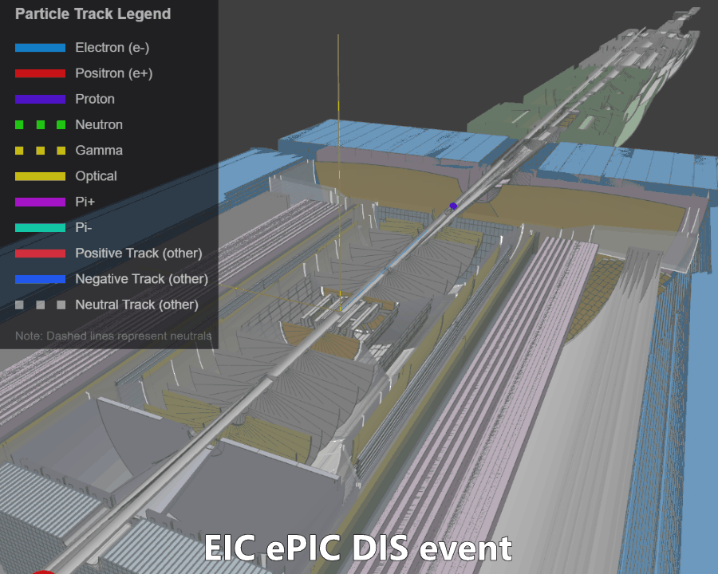

import { LinkCard } from '@theme';

<LinkCard
      href="https://seeeic.org"
      title=" EVENT DISPLAY"
      description="(!) Click HERE for Event Diplay (!)"
    />

The Firebird Event Display is moved to [https://seeeic.org](https://seeeic.org)
(aka "see EIC .org").
This website now only serve as a documentaion and tutorials for the event display

-----

# EIC Event Display

## Overview

- **Firebird** is a web-based event display framework for particle physics experiments,
specifically designed for the Electron-Ion Collider (EIC).

- Rather than a static "event display," Firebird is an **Event Player** capable of full 4D visualization,
showing how nuclear physics events and detector responses develop in time. Traditional static views
are also supported.

- As a core visualization tool for the EIC project, Firebird supports the needs of detector experts,
physicists, and science communications.

**Live deployment:** [https://seeeic.org](https://seeeic.org)

## Key Features

- **Web-based Architecture**: Built with Angular and Three.js, accessible from any device with a modern web browser. No installation required for end users.
- **Time-aware Visualization**: Support for streaming readout data with 4D visualization—play, pause, and scrub through time to see events unfold.
- **Modular Design**: Extensible through the Event Group Factory pattern for custom data loaders, visualization styles, and analysis tools.
- **Interactive Analysis**: Examine detector components, track particles, and inspect physics data with intuitive controls and raycasting selection.
- **Multi-experiment Support**: Designed for ePIC while maintaining compatibility with future IP8 detector and other experiments.
- **Comprehensive Data Handling**: Compatible with simulation outputs (EDM4eic via pyrobird), reconstruction data, and the Firebird DEX format.
- **Performance Optimized**: BVH acceleration for fast raycasting, web workers for data loading, and time-based filtering for efficient rendering.

The goal development of this software is to fulfill the
[Requirements for the Event Display for Electron Ion Collider](help/eic-requirements) and then go beyond them.

## Use Cases

- **Scientific Research and Analysis** - Firebird serves as a powerful tool for researchers working on
  detector optimization, particle reconstruction algorithms, and physics analysis. Its ability to visualize complex data structures helps in understanding detector responses and particle interactions at a detailed level.

- **Debugging and Quality Control** - For detector experts and software developers, Firebird offers specialized tools for debugging simulations, verifying reconstruction algorithms, and monitoring data quality. The time-aware rendering system helps identify timing issues and validate event reconstruction.

- **Education and Outreach** - Firebird transforms complex scientific concepts into engaging visualizations suitable for presentations, publications, and public engagement. Its intuitive interface makes it accessible to audiences with varying levels of scientific knowledge.

