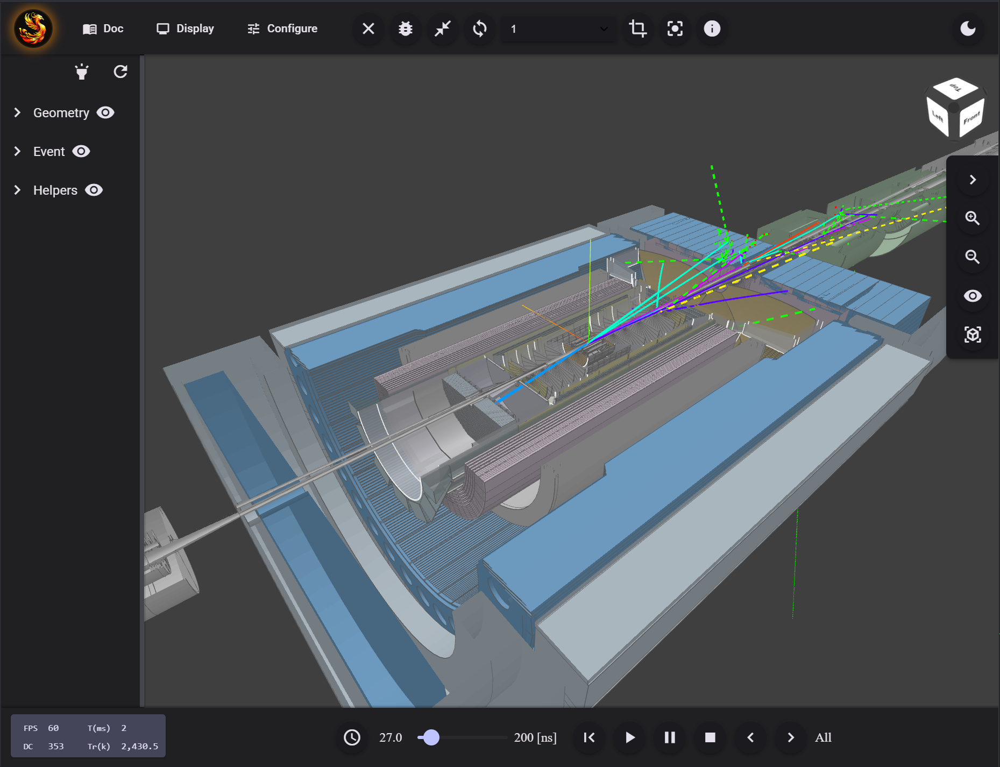
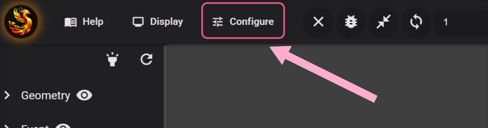

# Getting Started with Firebird Event Display

This tutorial will walk you through the basics of the user interface. 
Let's start with a quick tour of the main features.

## 1. First Look at the Display

When you first open Firebird, you'll see the main display page. 
This is where the 3D visualization happens. 
Take a moment to look around - you should see:

> If you don't see a detector and trajectories, it might not be a problem, 
> especially if you used Firebird before. Proceed with the tutorials 
> to a configuration section. If you still don't see anything, after configuring
> Firebird, proceed to [the Trobleshooting](../troubleshoot) section.

We will go in details of how to control everything, for now press 
**"Configure"** button to go into Firebird configuration. 

## 2. Select geoemetry and data

... navigate to Configure page, explain that for event display to work it needs geometry and events file.
For this tutorial we will use ready presets in the upper most menu ... 

The easiest way to start is with a preset configuration:

1. Look for the **"Select example configuration preset"** dropdown
2. Choose one of the options like:
   - "Full ePIC detector geometry (no events)" - for exploring just the detector
   - "DIS CC in ePIC" options - for viewing collision events
   - "DIRC optical photons" - for specialized detector studies

When you select a preset, it automatically fills in the geometry and event sources below.

## 3. Overview the interface

... By this moment geometry should be loaded ...

- A 3D view in the center showing the detector geometry
- Control buttons in the header toolbar
- Time controls at the bottom
- A view tool panel on the right side

Try these basic interactions:
- **🖱️ Left-click and drag** to rotate the view
- **🖱️ Right-click and drag** to pan
- **🖱️ Scroll** to zoom in and out

### View Controls

The floating panel on the right provides quick access to view controls:
- **Zoom buttons** (+/-) for precise zoom control
- **View options** (eye icon) for grids and visual aids
- **Camera mode** button to switch between perspective and orthographic views

### Scene Organization

Click the **tree icon** in the header to open the scene tree panel. This shows:
- All loaded geometry components
- Event data (tracks, hits, etc.)
- Visual helpers

You can:
- Click the eye icons to show/hide components
- Expand groups to see sub-components
- Hover over items to highlight them in the 3D view (when highlighting is enabled)

### Event Navigation

If you loaded multiple events:
1. Use the **event selector dropdown** in the header to switch between events
2. Each event is labeled with its ID for easy reference

### Time-Based Animation

The bottom toolbar controls time-based visualization:

- **Time slider** - Drag to see particles at different times
- **Play/Pause** - Animate particle trajectories
- **Step buttons** - Move forward/backward one time step
- **Rewind** - Return to the beginning
- **Stop** - Show all particles at once

Try playing an animation to see particles emerge from the collision point and travel through the detector!

### Geometry Clipping

The **crop icon** in the header opens clipping controls:
1. Enable clipping with the checkbox
2. Use the preset buttons for common views (half, quarter cuts)
3. Adjust angles manually with the sliders
4. This helps see inside the detector layers

### Measurement Tools

Click the **crosshair icon** to access measurement tools:
- **Show 3D Coordinates** - Display cursor position in detector coordinates
- **Show 3D Distance** - Measure distances between two points (click twice)

### Visual Helpers

Click the **eye icon** on the right panel to access:
- **Cartesian Grid** - Reference grid in X, Y, Z
- **Eta-Phi Grid** - Cylindrical coordinate system used in particle physics
- **Axis indicators** - Show coordinate axes
- **Labels** - Component names in 3D space

## 4. More configuration

### Manual Configuration (Optional)

We may select 

**Geometry:** Use the geometry dropdown to select a detector configuration. The URLs ending in `.root` contain different detector subsystems.

**Event Data:** You have two options:
- **JSON files** - Pre-converted event data that loads quickly
- **EDM4EIC ROOT files** - Raw simulation output (requires backend server)

For EDM4EIC files, you can specify which events to load using the range field (e.g., "0-5" for the first 6 events).

... here we have changes from that ...

Click the **DISPLAY** button to return to the main view with your selected data loaded.

### Performance Considerations

... here we have a lot of updates, check firebird-ng/src/app/pages/input-config for details ...

In the bottom-left corner, you'll see performance statistics (FPS, triangles, etc.). If performance is slow:

1. Hide unnecessary geometry using the scene tree
2. Go to Configure and enable "Performance over quality"
3. Reduce the number of loaded events

## 5. EIC simulation campaigns

... How to selct and navigate simulation campaign files

## Next Steps

... The next tutorial on how to install on local machine and use with your data via pyrobird.... 

